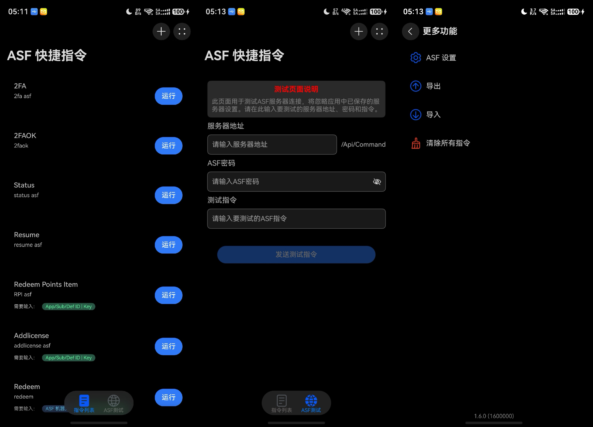
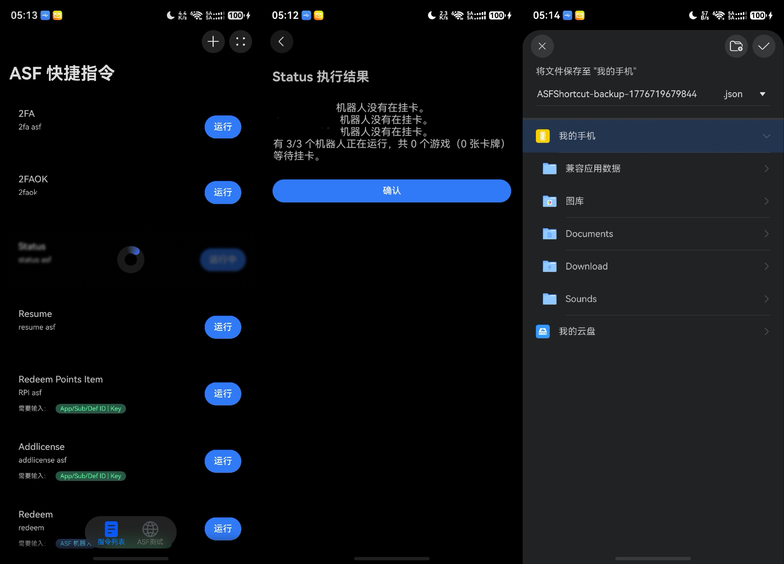

# ASFShortcut

A HarmonyOS client for [ArchiSteamFarm](https://github.com/JustArchiNET/ArchiSteamFarm) (ASF).

Send custom commands to ASF and view the results directly.

Demo video on Mate 60 Pro: [BV1LfU8BNEYB](https://www.bilibili.com/video/BV1LfU8BNEYB/) (outdated version, does not include sorting).

_Only tested on Mate 60 Pro._

## How It Works

The app communicates with your ASF instance by sending POST requests to its `/Api/Command` endpoint.

## Screenshots

<picture>
  
  
</picture>
